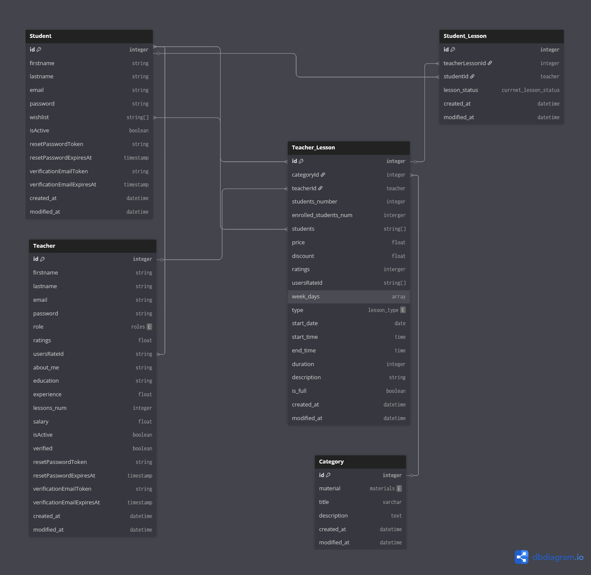

# Learning / Courses center app (for senior high school)

## 🔑 Description

- An app to book courses for senior high school students

### 🚀 Features

- Teachers : can be added, deleted, updated and create classes
- Students : can be added, deleted, updated and enroll in classes
- classes can be created, deleted, updated
- and more

## 🌐 Technologies

- For Backend

  - Node
  - Express
  - mongodb
  - graphql
  - jsonwebtoken
  - crypto
  - and more

- For Frontend
  - React
  - React-router
  - Graphql
  - Tailwind
  - jsonwebtoken
  - and more

## 🗄️ DB Diagram

